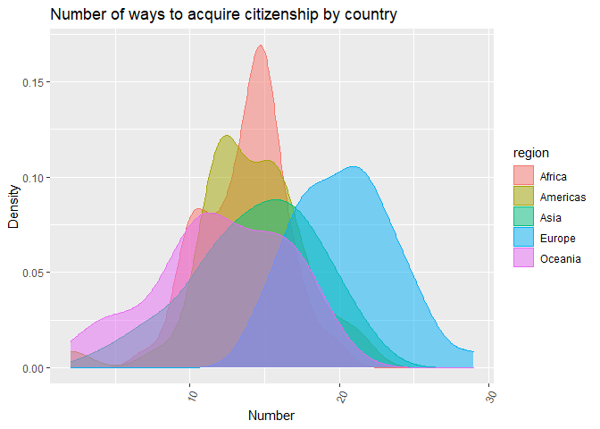
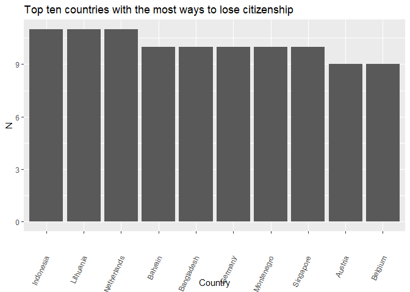

## Number of unique codes

-   Number **acquisition** variables: 24

-   **Acquisition** variables: A01, A02, A03, A04, A05, A06, A07, A08,
    A09, A10, A11, A12, A13, A14, A16, A18, A19, A20, A21, A22, A23,
    A24, A25, A26

-   Number **loss** variables: 14

-   **Loss** variables: L01, L02, L03, L04, L05, L06, L07, L08, L09,
    L10, L11, L12, L13, L14

-   Number of countries: 190

## Countries with 99 in A06 code

    ## # A tibble: 15 x 1
    ##    country    
    ##    <chr>      
    ##  1 China      
    ##  2 Congo DRC  
    ##  3 Micronesia 
    ##  4 Kuwait     
    ##  5 Lebanon    
    ##  6 Liberia    
    ##  7 Sri Lanka  
    ##  8 Myanmar    
    ##  9 Nepal      
    ## 10 Nauru      
    ## 11 Palau      
    ## 12 North Korea
    ## 13 Seychelles 
    ## 14 Uruguay    
    ## 15 Yemen

## Most common acq codes

## Acquiring citizenship by country

-   Median number of ways to acquire citizenship: 15

## Losing citizenship by country

-   Median number of ways to lose citizenship: 5

## Initial Observations

-   All countries share at one way to gain citizenship (A01)
-   There isn’t one universal way citizens can lose citizenship
-   L13 doesn’t apply to any countries in Africa, Oceania, or the
    Americas
