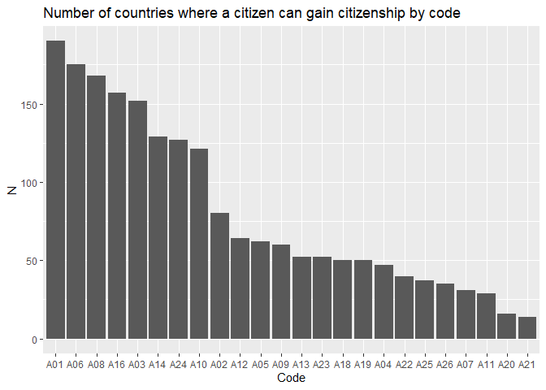
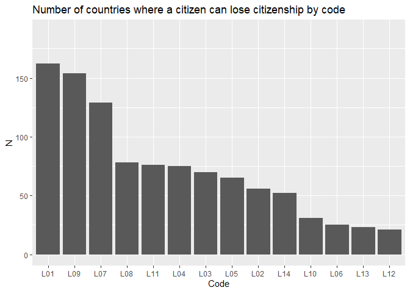

    library(magrittr)
    library(dplyr)
    library(tidyr)
    library(ggplot2)
    library(purrr)

    df <- readr::read_csv("../data/data_v1.0_country-year.csv")

    df_long <- df %>%
      tidyr::pivot_longer(names_to = "sub_code", values_to = "values", -c(iso3, country, year, region)) %>% 
      mutate(bin = grepl("bin", sub_code),
             acq = grepl("A", sub_code),
             loss = grepl("L", sub_code),
             code = substr(sub_code, 1, 3)
             )

## Number of unique codes

    acq_codes <- df_long %>% filter(acq) %>% distinct(code) %>% pull()
    n_acq <- length(acq_codes)

    loss_codes <- df_long %>% filter(loss) %>% distinct(code) %>% pull()
    n_loss <- length(loss_codes)

    n_cntry <- df %>% distinct(country) %>% pull() %>% length()

-   Number **acquisition** variables: 24

-   **Acquisition** variables: A01, A02, A03, A04, A05, A06, A07, A08,
    A09, A10, A11, A12, A13, A14, A16, A18, A19, A20, A21, A22, A23,
    A24, A25, A26

-   Number **loss** variables: 14

-   **Loss** variables: L01, L02, L03, L04, L05, L06, L07, L08, L09,
    L10, L11, L12, L13, L14

-   Number of countries: 190

## Countries with 99 in A06 code

    df_long %>%
      filter(bin) %>%
      filter(acq) %>%
      filter(values == 99) %>% 
      distinct(country)

    ## # A tibble: 15 x 1
    ##    country    
    ##    <chr>      
    ##  1 China      
    ##  2 Congo DRC  
    ##  3 Micronesia 
    ##  4 Kuwait     
    ##  5 Lebanon    
    ##  6 Liberia    
    ##  7 Sri Lanka  
    ##  8 Myanmar    
    ##  9 Nepal      
    ## 10 Nauru      
    ## 11 Palau      
    ## 12 North Korea
    ## 13 Seychelles 
    ## 14 Uruguay    
    ## 15 Yemen

## Most common acq codes

    acq_code_common <- df_long %>%
      filter(bin) %>%
      filter(acq) %>%
      filter(values == 1) %>%
      distinct(code, country) %>% 
      group_by(code) %>% 
      tally() %>% 
      arrange(desc(n))

    ggplot(acq_code_common, aes(x = reorder(code, -n), y = n)) +
      geom_bar(stat="identity") +
      labs(y = "N",
           x = "Code",
           title = "Number of countries where a citizen can gain citizenship by code") +
      ylim(0, n_cntry)

    loss_code_common <- df_long %>%
      filter(bin) %>%
      filter(loss) %>%
      filter(values == 1) %>%
      distinct(code, country) %>% 
      group_by(code) %>% 
      tally() %>% 
      arrange(desc(n))

    ggplot(loss_code_common, aes(x = reorder(code, -n), y = n)) +
      geom_bar(stat="identity") +
      labs(y = "N",
           x = "Code",
           title = "Number of countries where a citizen can lose citizenship by code") +
      ylim(0, n_cntry)

